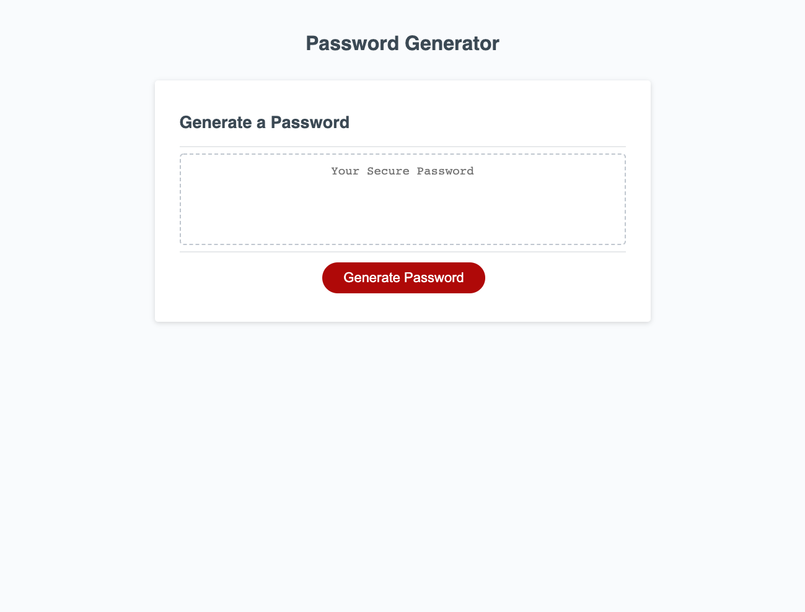

  <h2 align="center">Homework #3</h2>
  <h3 align="center">JavaScript: Password Generator</h3>

URL: https://scottcore.github.io/Homework3
## About The Project
  

    This week's homework assignment required me to modify start code to create an application that enables fictional employees to generte random passwords based on criteria that they've selected. The app runs in the browser and uses dynamically updated HTML and CSS from my JavaScript. It is adaptive to multiple screensizes and is user responsive with a clickable button and prompt and confirm boxes.
 

### Built With

* [JavaScript]()
* [CSS]()
* [HTML]()

<!-- LICENSE -->
## License

Distributed under the MIT License. 
